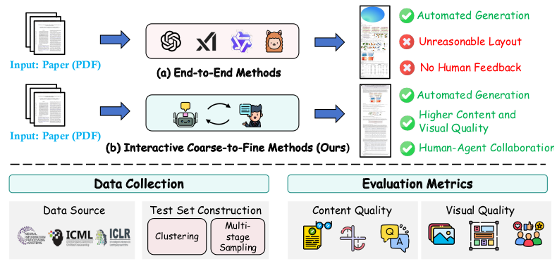
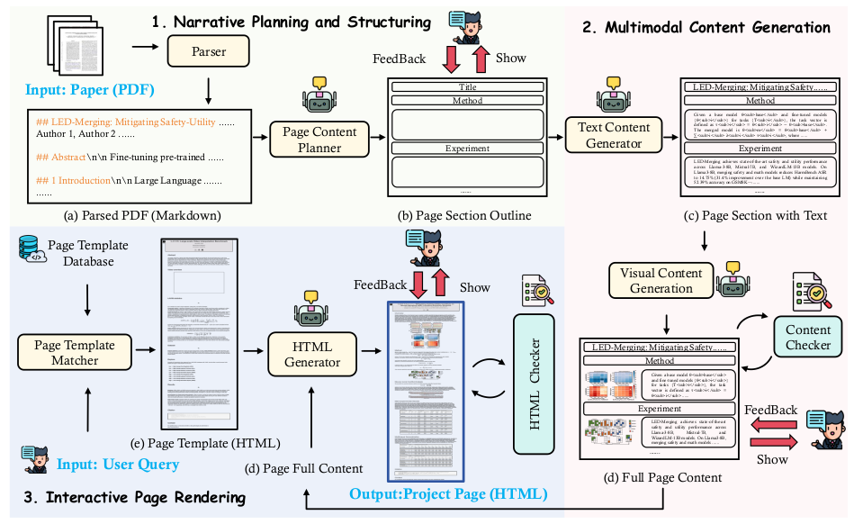

# AutoPage: Human-Agent Collaborative Paper-to-Page Crafting for Under $0.1

<p align="center">
  <a href="https://arxiv.org/abs/2510.19600" target="_blank"></a>
  <a href='https://mqleet.github.io/AutoPage_ProjectPage/'></a>
  <a href="https://huggingface.co/spaces/AutoLab-SJTU/AutoPage" target="_blank"></a>

</p >

## 🔥 News
- [2025.10.20] We release the paper, code and [project pages](https://mqleet.github.io/AutoPage_ProjectPage/) (Refresh the page to see a new version each time).


## :memo: TODO

- [x] Code Release
- [x] Paper Release
- [ ] Datasets
- [ ] Huggingface Demo

## 📋 Table of Contents

- [AutoPage: Human-Agent Collaborative Paper-to-Page Crafting for Under $0.1](#autopage-human-agent-collaborative-paper-to-page-crafting-for-under-01)
  - [🔎 Overview](#-overview)
  - [📚 Pipeline](#-pipeline)
  - [🛠️ Installation](#-installation)
  - [🚀 Quick Start](#-quick-start)
  - [💻 Start with Gradio](#-start-with-gradio)
  - [📐 Evaluation](#-evaluation)
  - [⚙️ Add Model for Camel](#-add-model-for-camel)


## 🔎 Overview
To address the questions **"How to create a webpage from an academic paper?"** and **"How to evaluate the project webpage?"**, we propose **AutoPage** and **PageBench**. AutoPage transforms academic papers into polished, published-ready project webpages through a human-in-the-loop multi-agent pipeline, while PageBench provides automatic evaluation across content quality and visual design quality dimensions.

<p align="center">
  
</p>


## 📚 Pipeline
**AutoPage** is a human-agent collaborative multi-agent system that transforms PDF documents into HTML project pages through interactive human feedback.



## 🛠️ Installation

### 🔧 Setup
**Environment**
```bash
conda create -n autopage python=3.10
conda activate autopage
pip install -r requirements.txt
conda install -c conda-forge poppler
```

And install the Playwright
```bash
playwright install
```


**API Key**

Create the `.env` file under the root path and add your API key (e.g., GEMINI_API_KEY, OPENAI_API_KEY, OPENROUTER_API_KEY):

```bash
OPENAI_API_KEY=<your_openai_api_key>
GEMINI_API_KEY=<your_gemini_api_key>
OPENROUTER_API_KEY=<your_openrouter_api_key>
```
to the `.env` file

---

## 🚀 Quick Start
Create a folder named `{pdfs}` under `{AutoPage}`, and place your paper inside it as a PDF file named `paper_name.pdf`.
```
📁 {AutoPage}/
└── 📁 {pdfs}/
    └── 📄 paper_name.pdf
```
To use open-source models, you need to first deploy them using [vLLM](https://docs.vllm.ai/en/v0.6.6/getting_started/installation.html), ensuring the port is correctly specified in the `get_agent_config()` function in [`utils/wei_utils.py`](utils/wei_utils.py).


- [**High Performance And Fast**] Generate a poster with `GPT-4o-mini` or `gemini-2.5-flash`:

You can select a template from the `templates` folder or define a template style. 
**A**.  If you will define the style, please leave `template_dir` and `template_file` **empty** and select `background_color`, `has_navigation`, `has_hero_section`,  `title_color`,  `page_density`, `image_layout` .
**B**.  If you have selected a template from the `templates` folder, as an example, please fill in the `template_dir` and `template_file` with `templates/airi-institute.github.io` and `templates/airi-institute.github.io/HairFastGAN/index.html`.

```bash
dataset_dir="pdfs"
paper_name="pdf_name"  # your_pdf_name

python -m ProjectPageAgent.main_pipline\
    --paper_path="${dataset_dir}/${paper_name}.pdf" \  # Do not change
    --model_name_t="your_text_model" \      # LLM
    --model_name_v="your_vlm_model" \       # VLM
    --template_root="templates" \           # Do not change
    --template_dir="your_template_dir" \
    --template_file="your_template_file" \
    --output_dir="generated_project_pages" \ 
    --full_content_check_times=2 \    
    --html_check_times=2 \          
    --resume='parse_pdf' \         
    --human_input='1' \          # Is human feedback required?
    --background_color='dark' \  # Background color ,choose in ['light', 'dark']
    --has_navigation="yes" \     # choose in ['yes', 'no']
    --has_hero_section="no" \    # choose in ['yes', 'no']
    --title_color="colorful" \   # choose in ['pure', 'colorful']
    --page_density="compact" \   # choose in ['spacious', 'compact']
    --image_layout="rotation"    # choose in ['rotation', 'parallelism']
    
```


AutoPage **supports flexible combination of LLM / VLM**, feel free to try other options, or customize your own settings in `get_agent_config()` in [`utils/wei_utils.py`](utils/wei_utils.py).


## 💻 Start with Gradio
If you prefer to run it in the frontend, just use the gradio via:
```python
python app.py
```

### 📹 Demo Video
We provide a complete Gradio demo video that demonstrates how to use AutoPage to generate project webpages from academic papers:

<video width="100%" controls>
  <source src="assets/demo_video.mp4" type="video/mp4">
  Your browser does not support the video tag.
</video>

*You can watch this video to understand the complete usage workflow and interface operations.*

## 📐 Evaluation

In evaluation, project pages are stored under a directory called `generated_project_pages`.

To evaluate a generated webpage :
```
python -m PageEval.page_eval\
    --paper_name="your_paper_name" \
    --html_path="yout_generated_html_path" \  # e.g ,generated_project_pages/AutoPage/index.html
    --vlm_name="gemini-2.5-flash" \      # VLM
    --llm_name="gemini-2.5-flash"        # LLM
   
```

## ⚙️ Add Model for Camel
AutoPage is based on  [CAMEL](https://github.com/camel-ai/camel), and the configuration file may not contain all the models you need.
If you need to add a new model, please follow the steps below：
1. Open file `utils/wei_utils.py` , add `elif` in  function `get_agent_config` and set it up like below:
  ```
  elif model_type == 'qwen-long':   # The name you use when calling
        agent_config = {
            "model_type": ModelType.QWEN_LONG,      # ModelType
            "model_config": QwenConfig().as_dict(),  # Confirm the model manufacturer you are using
            'model_platform': ModelPlatformType.QWEN, # Confirm the model ModelPlatformType you are using
        }
  ```

2. open file `camel/types/enums.py`, add ModelType using the above example：
  ```
    QWEN_LONG = "qwen-long"  # must be the formal name of the model in " " 

    def is_qwen(self) -> bool:
        return self in {
            ModelType.QWEN_MAX,
            ModelType.QWEN_PLUS,    
            ModelType.QWEN_TURBO,
            ModelType.QWEN_LONG,        # This is newly added
            ModelType.QWEN_VL_MAX,
            ModelType.QWEN_VL_PLUS,
            ModelType.QWEN_MATH_PLUS,
            ModelType.QWEN_MATH_TURBO,
            ModelType.QWEN_CODER_TURBO,
            ModelType.QWEN_2_5_CODER_32B,
            ModelType.QWEN_2_5_VL_72B,
            ModelType.QWEN_2_5_72B,
            ModelType.QWEN_2_5_32B,
            ModelType.QWEN_2_5_14B,
            ModelType.QWEN_QWQ_32B,
            ModelType.QWEN_QVQ_72B,
            ModelType.QWEN_QWQ_PLUS,
            ModelType.QWEN_PLUS_LATEST,
            ModelType.QWEN_PLUS_2025_04_28,
            ModelType.QWEN_TURBO_LATEST,
            ModelType.QWEN_TURBO_2025_04_28,
            ModelType.QWEN_3_CODER_PLUS,
        }
  ```
 **Following the same way you can add any model supported by Camel**


## ✒️ Citation

If you find AutoPage useful for your research and applications, please kindly cite our paper using this BibTeX:

```bibtex
@misc{ma2025paper2page,
      title={Human-Agent Collaborative Paper-to-Page Crafting for Under $0.1}, 
      author={Qianli Ma and Siyu Wang and Yilin Chen and Yinhao Tang and Yixiang Yang and Chang Guo and Bingjie Gao and Zhening Xing and Yanan Sun and Zhipeng Zhang},
      year={2025},
      eprint={2510.19600},
      archivePrefix={arXiv},
      primaryClass={cs.SE},
      url={https://arxiv.org/abs/2510.19600}, 
}

```

## ❤️ Acknowledgement

### ✍️ AutoPage Contributers

Order is based on the time joining the project:

>[Qianli Ma](https://mqleet.github.io/), [Yinhao Tang](https://github.com/tangyinhao), [Siyu Wang](https://github.com/WangSirMonster), [Yilin Chen](https://github.com/Jimuchen), [Zhening Xing](https://github.com/LeoXing1996).

### 🤗 Open-Sourced Repositories

This project wouldn't be possible without the following open-sourced repositories: [CAMEL](https://github.com/camel-ai/camel), [Docling](https://github.com/docling-project/docling), and [Paper2Poster](https://github.com/Paper2Poster/Paper2Poster). 

Thanks to all the contributors for their great work!
